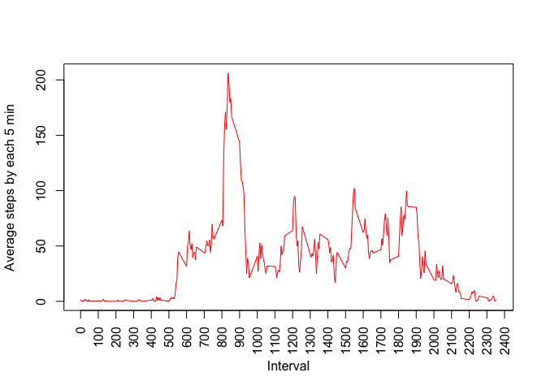

# Reproducible Research: Peer Assessment 1
PeerAssessment1
==================

##Loading and preprocessing the data  
**1. Load the data**  

By default all the chunks have echo=TRUE


```r
data <- read.csv(unzip("activity.zip"))
```

**2. Process/transform the data (if necessary) into a format suitable for your analysis**  

Reviewing the data


```r
str(data)
```

```
## 'data.frame':	17568 obs. of  3 variables:
##  $ steps   : int  NA NA NA NA NA NA NA NA NA NA ...
##  $ date    : Factor w/ 61 levels "2012-10-01","2012-10-02",..: 1 1 1 1 1 1 1 1 1 1 ...
##  $ interval: int  0 5 10 15 20 25 30 35 40 45 ...
```

Date is character variable, so I changed as a "date"


```r
library(lubridate)
data$date <- ymd(data$date)
```

## What is mean total number of steps taken per day?  

**Make a histogram of the total number of steps taken each day**
first I created a data frame with the sum per day (and I created a new variable with the date to plot the histogram)


```r
sumsteps <- tapply(data$steps, data$date, sum)
sumsteps <- data.frame(sumsteps)
sumsteps$date <- ymd(row.names(sumsteps))
plot(sumsteps$date, sumsteps$sumsteps, type="h", col="red", xlab="day", ylab="Sum of steps")
```

 

**Calculate and report the mean and median total number of steps taken per day**  

The mean


```r
mean(sumsteps$sumsteps, na.rm=T)
```

```
## [1] 10766
```

And the median


```r
median(sumsteps$sumsteps, na.rm=T)
```

```
## [1] 10765
```

  
## What is the average daily activity pattern?  

**Make a time series plot (i.e. type = "l") of the 5-minute interval (x-axis) and the average number of steps taken, averaged across all days (y-axis)**


```r
meanintervals <- tapply(data$steps, data$interval, mean, na.rm=T)
meanintervals<- data.frame(meanintervals)
meanintervals$intervals <- rownames(meanintervals)
plot(meanintervals$intervals, meanintervals$meanintervals, type="l", col="red", xlab="Interval", ylab="Average steps by each 5 min", xaxt="n")
axis(1, at = seq(0, 2600, by = 100), las=2)
```

 

**Which 5-minute interval, on average across all the days in the dataset, contains the maximum number of steps?** The answer is the 835 "5-minute interval"


```r
meanintervals[which(meanintervals$meanintervals==max(meanintervals$meanintervals)),]
```

```
##     meanintervals intervals
## 835         206.2       835
```
  

##Imputing missing values

** Calculate and report the total number of missing values in the dataset (i.e. the total number of rows with NAs)**

The total number of NA´s is


```r
sum(is.na(data))
```

```
## [1] 2304
```

By column, I created a function to know the sum of missing data by column; after apply this function by column


```r
sumna <- function(x){sum(is.na(x))}
apply(data,2,sumna)
```

```
##    steps     date interval 
##     2304        0        0
```

**Devise a strategy for filling in all of the missing values in the dataset.**

Firts I created a new data base (dat2) to change the date and interval as factors and steps as numeric, it is because the package "mice" (I´m going to use this package to filling in the missing data) needs as numeric or factor to fill in the data.


```r
dat2 <- data
dat2$steps <- as.numeric(dat2$steps)
dat2$date <- as.factor(dat2$date)
dat2$interval <- as.factor(dat2$interval)
```


** Create a new dataset that is equal to the original dataset but with the missing data filled in.**

After I charged the "mice" package, set the seed and completed the database, first dat3 is an object of class "mids" and with the function "complete" fill in the missing data and return the completed database (dat4 is going to be the final database). 


```r
library(mice)
```

```
## Loading required package: Rcpp
## Loading required package: lattice
## mice 2.22 2014-06-10
```

```r
dat3 <- mice(dat2, seed= 1)
```

```
## 
##  iter imp variable
##   1   1  steps
##   1   2  steps
##   1   3  steps
##   1   4  steps
##   1   5  steps
##   2   1  steps
##   2   2  steps
##   2   3  steps
##   2   4  steps
##   2   5  steps
##   3   1  steps
##   3   2  steps
##   3   3  steps
##   3   4  steps
##   3   5  steps
##   4   1  steps
##   4   2  steps
##   4   3  steps
##   4   4  steps
##   4   5  steps
##   5   1  steps
##   5   2  steps
##   5   3  steps
##   5   4  steps
##   5   5  steps
```

```r
dat4 <- complete(dat3)
```

The new database has no NA's


```r
str(dat4)
```

```
## 'data.frame':	17568 obs. of  3 variables:
##  $ steps   : num  0 0 0 0 0 0 0 0 0 0 ...
##  $ date    : Factor w/ 61 levels "2012-10-01","2012-10-02",..: 1 1 1 1 1 1 1 1 1 1 ...
##   ..- attr(*, "contrasts")= num [1:61, 1:60] 0 1 0 0 0 0 0 0 0 0 ...
##   .. ..- attr(*, "dimnames")=List of 2
##   .. .. ..$ : chr  "2012-10-01" "2012-10-02" "2012-10-03" "2012-10-04" ...
##   .. .. ..$ : chr  "2" "3" "4" "5" ...
##  $ interval: Factor w/ 288 levels "0","5","10","15",..: 1 2 3 4 5 6 7 8 9 10 ...
##   ..- attr(*, "contrasts")= num [1:288, 1:287] 0 1 0 0 0 0 0 0 0 0 ...
##   .. ..- attr(*, "dimnames")=List of 2
##   .. .. ..$ : chr  "0" "5" "10" "15" ...
##   .. .. ..$ : chr  "2" "3" "4" "5" ...
```

```r
summary(dat4)
```

```
##      steps               date          interval    
##  Min.   :  0.0   2012-10-01:  288   0      :   61  
##  1st Qu.:  0.0   2012-10-02:  288   5      :   61  
##  Median :  0.0   2012-10-03:  288   10     :   61  
##  Mean   : 34.5   2012-10-04:  288   15     :   61  
##  3rd Qu.:  7.0   2012-10-05:  288   20     :   61  
##  Max.   :806.0   2012-10-06:  288   25     :   61  
##                  (Other)   :15840   (Other):17202
```

After I returned date as a "date" in my new database (dat4)


```r
dat4$date <- ymd(dat4$date)
```

**4.1 Make a histogram of the total number of steps taken each day **


```r
sumsteps <- tapply(dat4$steps, dat4$date, sum)
sumsteps <- data.frame(sumsteps)
sumsteps$date <- ymd(row.names(sumsteps))
plot(sumsteps$date, sumsteps$sumsteps, type="h", col="red", xlab="day", ylab="Sum of steps")
```

 


**4.2 Calculate and report the mean and median total number of steps taken per day**
  
The mean


```r
mean(sumsteps$sumsteps, na.rm=T)
```

```
## [1] 9941
```
  
The median


```r
median(sumsteps$sumsteps, na.rm=T)
```

```
## [1] 10395
```

**4.3 Do these values differ from the estimates from the first part of the assignment? What is the impact of imputing missing data on the estimates of the total daily number of steps?**
Yes the values were modified, even though the imputation of data was made with the mice package, the most modified was the median.

##Are there differences in activity patterns between weekdays and weekends?
** Use the dataset with the filled-in missing values for this part. Create a new factor variable in the dataset with two levels – “weekday” and “weekend” indicating whether a given date is a weekday or weekend day.**  

First I created a new variable "dofweek" that has the day of the week, after another variable "week" that describes if is "weekend" or "weekday".


```r
dat4$dofweek <- weekdays(dat4$date)
dat4$week <- as.factor(ifelse(dat4$dofweek %in% c("Saturday","Sunday"), "Weekend", "Weekday"))
```


**Make a panel plot containing a time series plot (i.e. type = "l") of the 5-minute interval (x-axis) and the average number of steps taken, averaged across all weekday days or weekend days (y-axis).**


```r
par(mfcol=c(2,1))
dat5 <- dat4[which(dat4$week=="Weekend"),]
meanintervals <- tapply(dat5$steps, dat5$interval, mean, na.rm=T)
meanintervals<- data.frame(meanintervals)
meanintervals$intervals <- rownames(meanintervals)
plot(meanintervals$intervals, meanintervals$meanintervals, type="l", col="red", xlab="Interval", ylab="Number of steps", main="Weekend", ylim=c(0,250))
dat6 <- dat4[which(dat4$week=="Weekday"),]
meanintervals <- tapply(dat6$steps, dat6$interval, mean, na.rm=T)
meanintervals<- data.frame(meanintervals)
meanintervals$intervals <- rownames(meanintervals)
plot(meanintervals$intervals, meanintervals$meanintervals, type="l", col="red", xlab="Interval", ylab="Number of steps", main="Weekdays", ylim=c(0,250))
```

 


